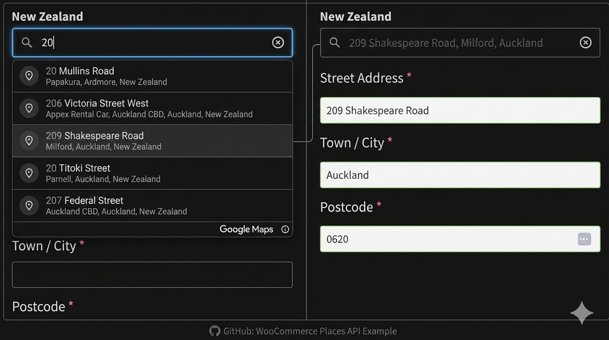

# WooCommerce Google Address Autocomplete (Places API)

WordPress plugin that adds Google Places autocomplete to WooCommerce checkout billing and shipping address fields.

## Repository Layout

- `google-autocomplete-plugin/google-autocomplete-plugin.php` - Main plugin file
- `google-autocomplete-plugin/readme.txt` - WordPress plugin readme format
- `google-autocomplete-plugin/assets/` - Frontend JS/CSS
- `LICENSE` - Project license (GPL-3.0-or-later)

## Requirements

- WordPress 6.0+
- WooCommerce
- PHP 7.4+
- Google Maps Places API key

## Installation

1. Upload the `google-autocomplete-plugin.zip` to your WordPress plugins.
2. Activate the plugin.
3. Go to `Settings -> Google Autocomplete`.
4. Add your Google Maps API key and save.

## License

This project is licensed under GNU GPL v3.0 or later.
